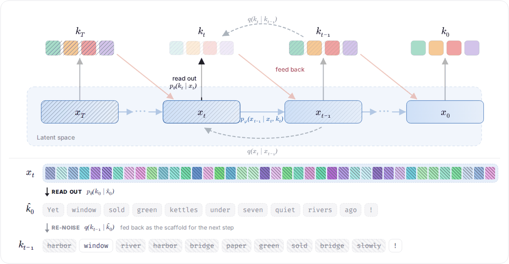
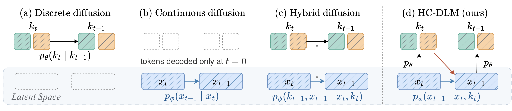
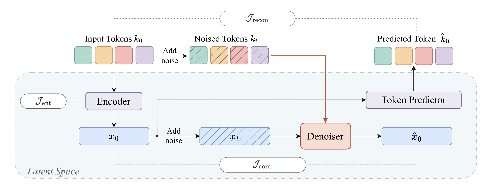
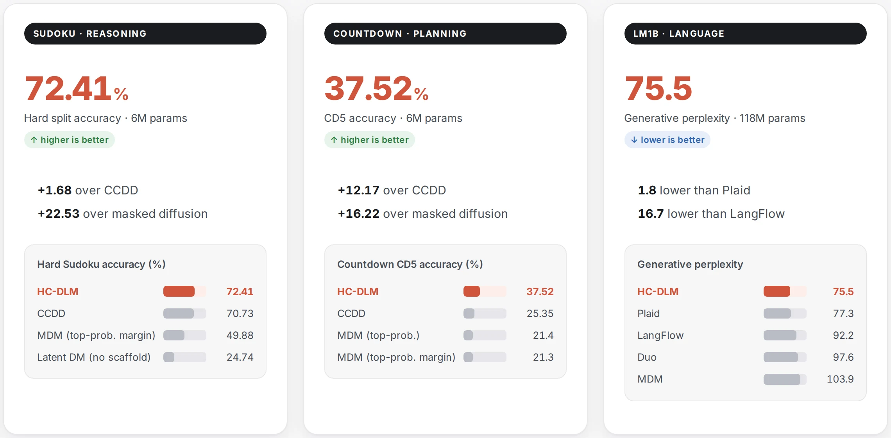
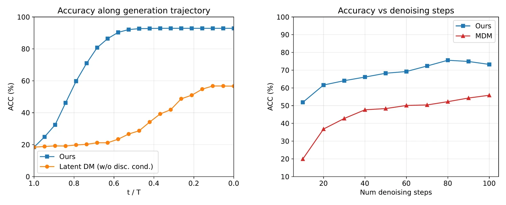

<h1 align="center">Hierarchical Continuous Diffusion Language Models</h1>

<p align="center">
  <a href="https://hc-dlm.github.io/"></a>
  
  
</p>

<p align="center"><b>Augmenting Continuous Diffusion Language Models with Discrete Token Guidance</b></p>

<p align="center">
  <a href="https://rhfeiyang.top/">Hui Ren</a><sup>1</sup>,
  <a href="https://www.linkedin.com/in/zihan-li-616b68325/">Zihan Li</a><sup>1</sup>,
  <a href="https://ruachang.github.io/">Chang Liu</a><sup>1</sup>,
  <a href="https://harryliew.github.io/">Huidong Liu</a><sup>2</sup>,
  <a href="https://www.alexander-schwing.de/">Alexander Schwing</a><sup>1</sup><br>
  <sup>1</sup>University of Illinois Urbana-Champaign &nbsp;&nbsp; <sup>2</sup>Amazon.com, Inc.
</p>

<p align="center"><i><b>HC-DLM</b> augments continuous diffusion language models with discrete token guidance:<br>a shared latent plans every token jointly, while tokens read out at each step keep it anchored to valid text.</i></p>

<p align="center">
  <a href="https://hc-dlm.github.io/"></a>
</p>
<p align="center"><sub>The latent plans, the tokens guide, at every step (simulated example). Interactive version on the <a href="https://hc-dlm.github.io/">project page</a>.</sub></p>


## 💡 Idea

Each family of diffusion language models has a blind spot:

- **Discrete diffusion** decodes tokens in parallel, but samples each one **independently** from its marginal.
- **Continuous diffusion** plans all tokens in one shared latent, but **never checks that plan against real tokens** until the very end.

HC-DLM keeps both strengths: tokens are planned jointly in the latent, and the latent is guided by tokens at every step. The continuous latent is the only persistent generative state; at every step the model reads a token draft $k_t$ out of the latent $x_t$, and that draft guides the next latent update.

$$
p_{\theta,\phi}(k_{0:T},x_{0:T})=p(x_T)\,p_\theta(k_0\mid x_0)\prod_{t=1}^{T}\underbrace{p_\theta(k_t\mid x_t)}_{\text{read out tokens}}\;\underbrace{p_\phi(x_{t-1}\mid x_t,k_t)}_{\text{token-guided latent denoising}}
$$

<p align="center">
  
</p>
<p align="center"><sub><b>One reverse step, four designs.</b> Discrete diffusion updates tokens directly, one marginal at a time. Continuous diffusion denoises a latent that is blind to tokens and decodes only at the end. Hybrid models attach a continuous signal to a self-contained discrete chain. In HC-DLM the two levels talk at every step: tokens are read out of the latent, then guide its next update.</sub></p>

|                                 | Discrete diffusion<br><sub>e.g. MDM, LLaDA</sub> | Continuous diffusion<br><sub>e.g. Diffusion-LM, Plaid</sub> | Hybrid discrete–continuous<br><sub>e.g. CADD, CCDD</sub> | **HC-DLM (ours)** |
|---------------------------------|:---:|:---:|:---:|:---:|
| Token dependence within a step  | ✕<br><sub>independent marginals</sub> | ✓ | ◐<br><sub>via conditioning only</sub> | ✓ |
| Tied to tokens at every step    | ✓ | ✕<br><sub>only at <i>t</i> = 0</sub> | ✓ | ✓ |
| Tokens revisable at every step  | ◐<br><sub>uniform kernel only</sub> | ✓ | ◐<br><sub>uniform kernel only</sub> | ✓<br><sub>readout from <i>x<sub>t</sub></i></sub> |

Noise corrupts tokens and latent independently, so training stays simple. A single variational bound on the token likelihood splits into three terms and trains everything end to end: reconstruction for the token readout, token-guided flow matching for the latent denoiser, and an entropy term that keeps the encoder from collapsing.

<p align="center">
  
</p>
<p align="center"><sub><b>One principled objective, trained end to end.</b> An encoder maps clean tokens to a latent, independent forward kernels produce the noisy pair, the token-conditioned denoiser predicts the clean latent, and the token predictor decodes it back to tokens.</sub></p>

## 📊 Results

From Sudoku and Countdown to open-domain text, HC-DLM leads discrete, continuous and hybrid diffusion baselines of the same size on Hard Sudoku, Countdown and LM1B. Parameter counts exclude token embeddings.

<p align="center">
  
</p>

<p align="center">
  
</p>
<p align="center"><sub><b>Left:</b> solutions emerge early: accuracy of the intermediate prediction decoded at each step, vs. latent diffusion without token guidance. <b>Right:</b> holds up with fewer steps: Hard Sudoku accuracy against step count; MDM degrades sharply as steps shrink.</sub></p>

<details>
<summary><b>📋 Full tables</b> (accuracy %; generative perplexity, lower is better)</summary>
<br>

**Sudoku & Countdown** (6M parameters, accuracy %)

| Method                  | Sudoku Easy | Sudoku Hard |       CD4 |       CD5 |
|-------------------------|------------:|------------:|----------:|----------:|
| MDM (top-prob. margin)  |       89.49 |       49.88 |      50.8 |      21.3 |
| CCDD                    |   **94.65** |       70.73 |     81.18 |     25.35 |
| **HC-DLM**              |       94.21 |   **72.41** | **84.41** | **37.52** |

**LM1B** (generative perplexity)

| Method     | Params | Gen. PPL ↓ |
|------------|-------:|-----------:|
| MDM        |   116M |      103.9 |
| Duo        |   116M |       97.6 |
| LangFlow   |   117M |       92.2 |
| Plaid      |   109M |       77.3 |
| **HC-DLM** |   118M |   **75.5** |

**Ablation:** neither level works alone. Latent DM removes token guidance from the denoiser; MDM removes the latent altogether (Sudoku accuracy %).

| Method                          | Cont. latent | Token guidance |      Easy |      Hard |
|---------------------------------|:------------:|:--------------:|----------:|----------:|
| MDM (top-prob. margin)          |      ✕       |       ✕        |     89.49 |     49.88 |
| Latent DM (w/o token guidance)  |      ✓       |       ✕        |     50.46 |     24.74 |
| **HC-DLM**                      |      ✓       |       ✓        | **94.21** | **72.41** |

</details>

## 📦 Release

The code and the artifacts are coming soon. Stay tuned!

## 📖 Citation

If you find this work useful, please consider citing:

```bibtex
@article{ren2026hierarchical,
  title   = {Hierarchical Continuous Diffusion Language Models},
  author  = {Ren, Hui and Li, Zihan and Liu, Chang and Liu, Huidong and Schwing, Alexander},
  journal = {arXiv preprint arXiv:XXXX.XXXXX},
  year    = {2026}
}
```
